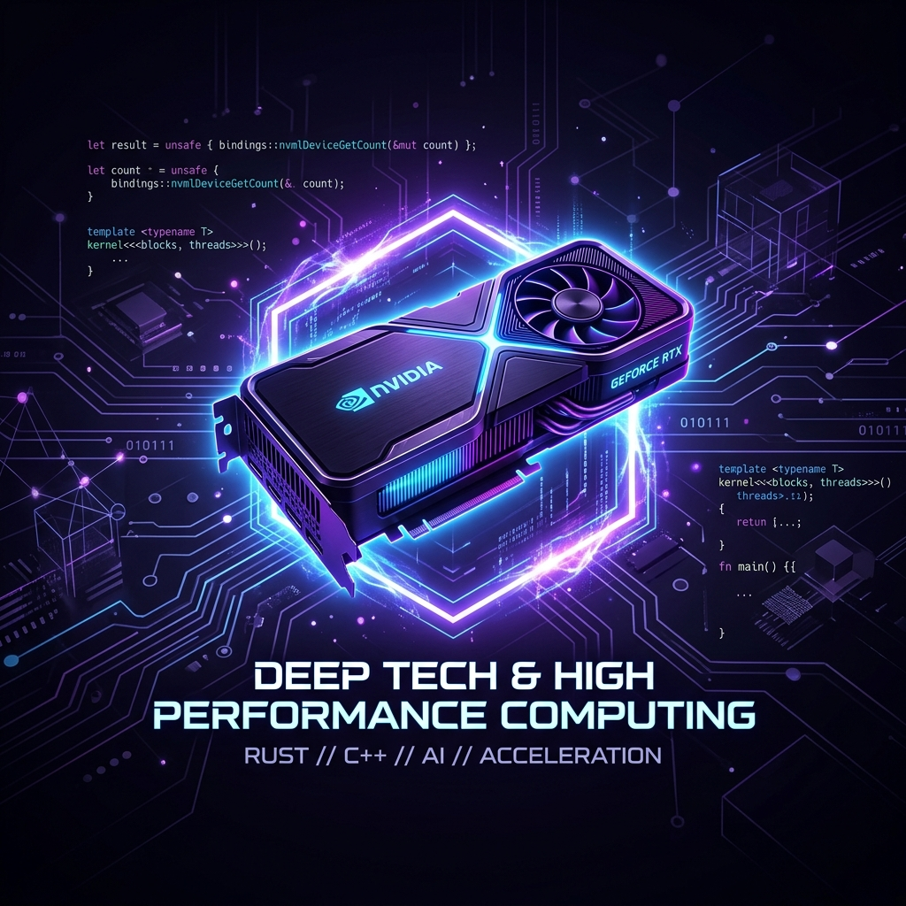

# 👋 Hi there, I'm SHI66ie

I am a **Full-Stack Developer & Blockchain Enthusiast** focused on building decentralized applications, AI-driven simulations, and high-performance tools. Currently, I'm developing **BlockMusic**, a Web3 music streaming platform, and the **FMWA API** ecosystem, while exploring **GPU-accelerated mining** with Rust.

- 🔭 I’m currently working on [BlockMusic](https://github.com/SHI66ie/BlockMusic), [fmwa-api](https://github.com/SHI66ie/fmwa-api), and [Kobayashi-Ai](https://github.com/SHI66ie/Kobayashi-Ai).
- 💻 Most used line of code: `git commit -m "Initial Commit"`
- 🤔 I’m looking for ways to optimize AI strategy calls for real-time telemetry.
- 📫 How to reach me: [ybarkido@gmail.com ] (Update with your actual email)
- ⚡ Fun fact: I'm building an AI Co-driver for racing simulations.

---

## 🛠️ Technology Stack

### 🦀 Backend & Systems

### 🌐 Web & Web3

### ⚙️ Tools & Hardware

---

## 📊 GitHub Stats

  

  

---

## 🛡️ Socials

---

<b>Detailed Journey & Goals</b>

### 🏁 The Goal
My ultimate goal is to build decentralized platforms that empower creators and innovate in the AI/Simulation space.

### 🛠️ Current Projects
- **BlockMusic**: A decentralized music streaming ecosystem.
- **FMWA (Federal Ministry of Women Affairs website)**: Core API for the FMWA ecosystem.
- **Kobayashi-Ai**: AI-driven strategy calls for racing sims.
- **HASH Miner RS**: Efficient GPU mining in Rust.

